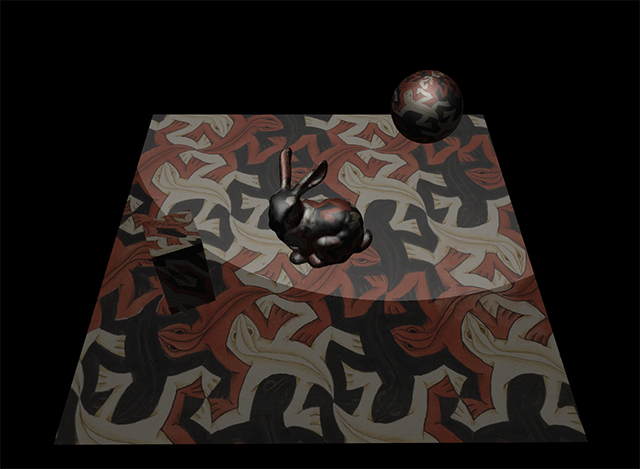

# dowel

A toy library for learning WebGL2 concepts

## Installation and use

todo

## Example scene

Start a local webserver in the repository, then navigate to `localhost:[port]/example/index.html` to see a loaded model. Currently this repo uses the Stanford Bunny, which is provided by the [Stanford Computer Graphics Laboratory](http://graphics.stanford.edu/data/3Dscanrep/#bunny).

## Building the library

The npm script `npm run build` kicks off Rollup, and produces the file at `dist/dowel.js`.

## Dependencies

dowel includes two libraries for its dependencies: [gl-matrix](https://github.com/toji/gl-matrix) for the math, and [webgl-obj-loader](https://github.com/frenchtoast747/webgl-obj-loader) for simple OBJ file parsing. They're both excellent libraries and I encourage you to check them out.

## Task list

* Write readme
* refactor gl into a singleton module
* screenshots
* add rollup
* documentation
