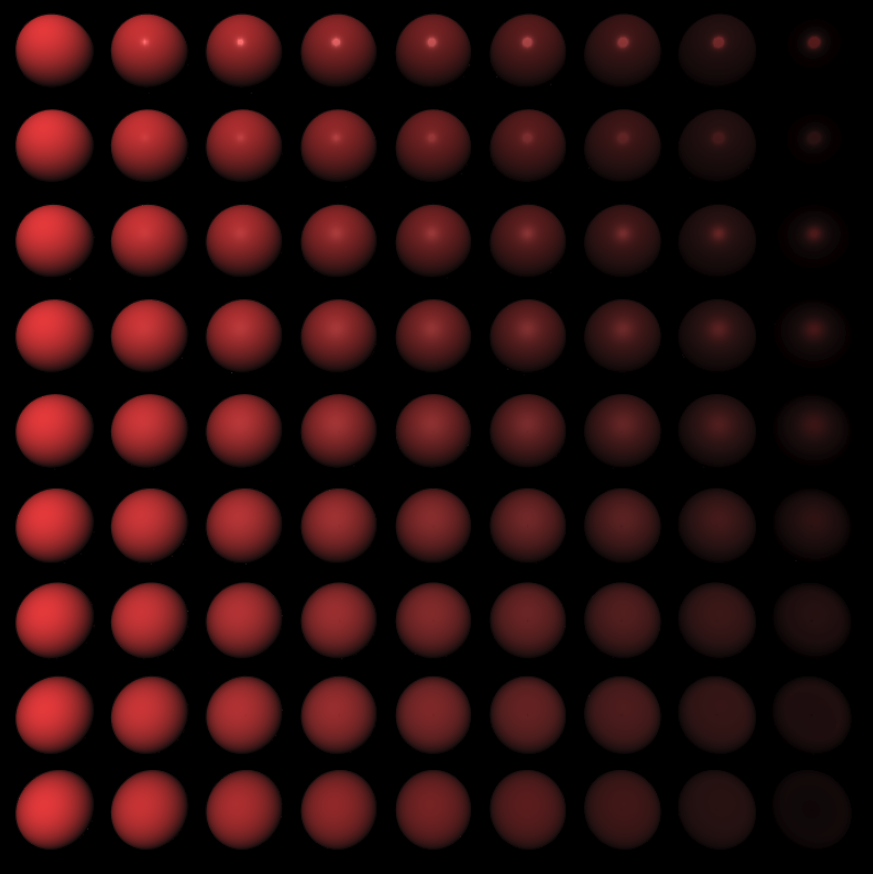
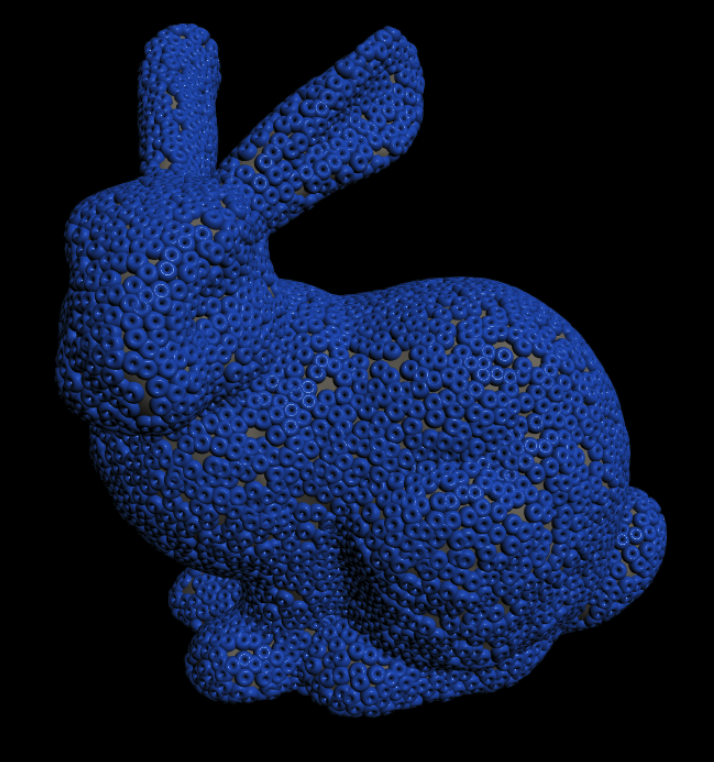

# dowel

A toy library for learning WebGL2 concepts

## Installation and use

The library is designed as a set of ES6 modules so you can manage your own minification etc.

## Example scene

Start a local webserver in the repository, then navigate to `localhost:[port]/examples` to see several sample projects.

## Building the library

The npm script `npm run build` kicks off Rollup, and produces the file at `dist/dowel.js`.

## Dependencies

dowel includes two libraries for its dependencies: [gl-matrix](https://github.com/toji/gl-matrix) for the math, and [webgl-obj-loader](https://github.com/frenchtoast747/webgl-obj-loader) for simple OBJ file parsing. They're both excellent libraries and I encourage you to check them out.

## Example Models

* Stanford Bunny, provided by the [Stanford Computer Graphics Laboratory](http://graphics.stanford.edu/data/3Dscanrep/#bunny)
* Utah Teapot
* Asteroid Ryugu, assembled by [Doug Ellison](https://sketchfab.com/models/44876e2f0d314b05ba32b0472a1eddc6) for reuse.

## Task list

* documentation

## Screenshots

